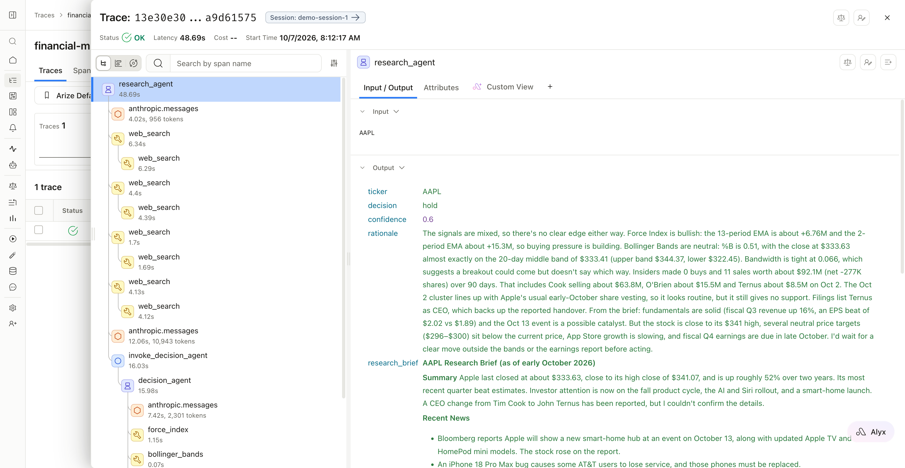
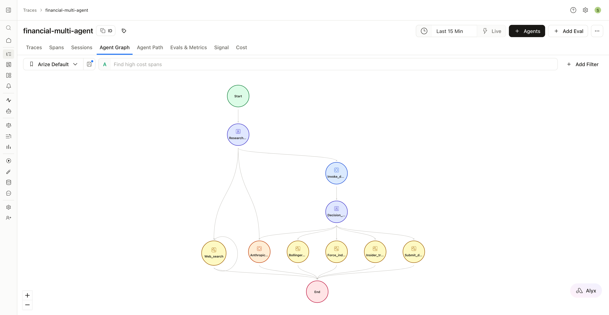

# Multi-agent financial analysis with manual Arize tracing

Three containers turn a ticker into a **buy / hold / sell** decision. Every span is written by hand
with OpenInference semantic conventions and exported to Arize AX as **one connected trace**.

```
client ─POST /invoke─► research-agent ──MCP (traceparent+baggage in _meta)──► websearch-mcp ─► Tavily
                            │
                            └──POST /invoke (traceparent+baggage headers)──► decision-agent
                                                                              ├─ force_index
                                                                              ├─ bollinger_bands
                                                                              └─ insider_trades (yfinance)
```

## Run

```bash
cp .env.example .env        # fill in ANTHROPIC_API_KEY, TAVILY_API_KEY, ARIZE_SPACE_ID, ARIZE_API_KEY
docker compose up --build   # or `docker-compose up --build` if Compose is a standalone binary
uv run scripts/analyze.py AAPL
```

The response includes a `trace_id`; search for it in your Arize project (`ARIZE_PROJECT_NAME`,
default `financial-multi-agent`). Without Arize keys, spans are printed to each container's logs.

Every run makes real, billed Claude and Tavily calls (an analysis takes roughly a minute).

More runs and housekeeping:

```bash
uv run scripts/analyze.py MSFT --session demo-1   # same --session groups runs into one Arize session
uv run scripts/analyze.py NVDA --url http://localhost:8001
docker compose logs -f research-agent             # follow one service
docker compose down                               # stop everything
```

### Apple Silicon (M4) + Colima note

The research-agent and websearch-mcp images set `OPENSSL_armcap=0`. Without it, those containers
exit immediately with code 132 (SIGILL) on Apple M4 hosts running a VM such as Colima: OpenSSL,
loaded via `cryptography` (a dependency of `mcp`), probes ARM SME/SVE2 CPU features the VM exposes
but cannot execute. The setting only disables that probing and has no practical cost here.

## What to look for in Arize

- One trace: `research_agent` (AGENT) → LLM / `web_search` (client) → `web_search` (server, other container)
  → `invoke_decision_agent` (CHAIN) → `decision_agent` (AGENT) → LLM / indicator TOOL spans → `submit_decision`.
- Every span carries the same `session.id`, `user.id`, `metadata`, `tag.tags` and `finagent.ticker`,
  even across containers — baggage carries them and each service rebuilds `using_attributes`.
- LLM spans: input/output messages including tool calls, token counts, prompt template + version.
- Filter on `finagent.decision`, `finagent.bollinger.signal`, `finagent.force_index.trend`, ...

One AAPL run: the research agent's four `web_search` calls each contain the MCP server's own span,
and the decision agent (from a different container) sits under `invoke_decision_agent`.



Arize's Agent Graph built from the same spans:



## Code map

- `common/fin_tracing` — all tracing code: provider/exporter, span helpers, Anthropic→OpenInference
  mapping, cross-process propagation.
- `services/websearch_mcp` — MCP server (`MCPServer`, streamable HTTP) with the `web_search` tool.
- `services/research_agent` — entry point; Claude tool loop over MCP tools; calls the decision agent.
- `services/decision_agent` — Claude tool loop over local indicator tools; `submit_decision` ends it.

FastAPI and the MCP Python SDK emit their own OpenTelemetry spans whenever a tracer provider is
configured. To keep the trace purely manual, `fin_tracing` records only its own tracer and hands
every other library a pass-through no-op tracer (see `FinTracingOnlyProvider`).

## Tests

```bash
uv sync
uv run pytest
```

`tests/test_end_to_end.py` runs all three services in-process and asserts the single-trace shape.
